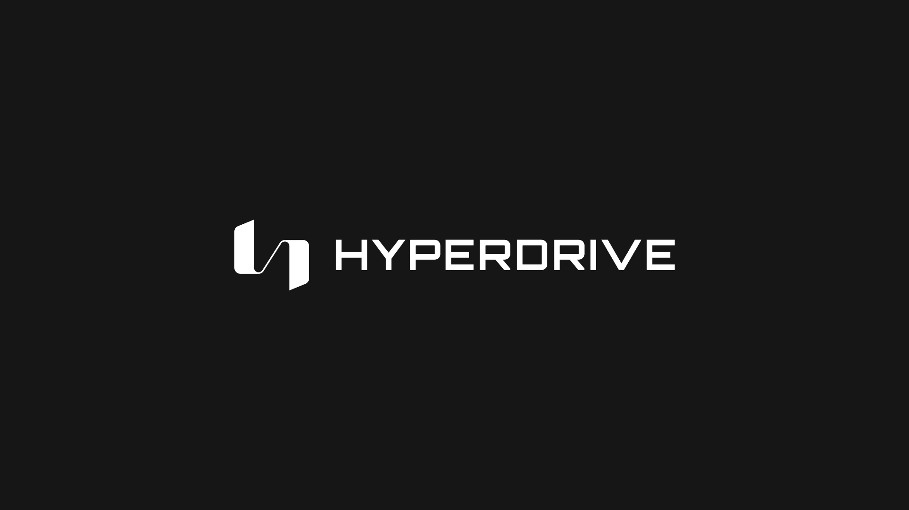

# Hyperdrive Trading UI

Description for hyperdrive trading UI

Get started with the [Docs](https://github.com/delvtech/council-kit/wiki).

Requires `Node 14+`.

## What's inside?

This monorepo uses [Yarn](https://classic.yarnpkg.com/) as a package manager. It includes the following packages/apps:

### Apps

| Name                                                                                                    | Description                                                                        |
| ------------------------------------------------------------------------------------------------------- | ---------------------------------------------------------------------------------- |
| [hyperdrive-trading](https://github.com/delvtech/hyperdrive-monorepo/tree/main/apps/hyperdrive-trading) | A user interface implementing the hyperdrive protocol built on the typescript sdk. |

### Packages

| Name                                                                                                  | Description                                            |
| ----------------------------------------------------------------------------------------------------- | ------------------------------------------------------ |
| [hyperdrive-sdk](https://github.com/delvtech/council-kit/tree/main/packages/council-sdk)              | A TypeScript SDK for the Hyperdrive protocol           |
| [hyperdrive-viem](https://github.com/delvtech/hyperdrive-monorepo/tree/main/packages/hyperdrive-viem) | A Viem implementation of the Hyperdrive Typescript SDK |

### Utility Packages

| Name                                                                                                        | Description                          |
| ----------------------------------------------------------------------------------------------------------- | ------------------------------------ |
| [@council/eslint-config](https://github.com/delvtech/council-kit/tree/main/packages/@council/eslint-config) | Package for static type checking.    |
| [prettier-config](https://github.com/delvtech/council-kit/tree/main/packages/prettier-config)               | Package for code formatting.         |
| [@council/tsconfig](https://github.com/delvtech/council-kit/tree/main/packages/tsconfig)                    | Package for TypeScript configuation. |

Each package/app is 100% [TypeScript](https://www.typescriptlang.org/).

## Monorepo commands

### Build

To build all apps and packages, run the following command:

```bash
yarn build

# build only packages (useful for app development)
yarn build:packages

```

### Develop

To run the development server for all apps, run the following command:

```bash
yarn dev
```

### Linting

To run linting on all apps and packages, run the following command:

```bash
yarn lint
```

### Formatting

To run formatting on all apps and packages, run the following command:

```bash
yarn format:check

# write formatting changes to files
yarn format

```

## Development

1. Clone the repo: `git clone git@github.com:delvtech/council-kit.git`
2. Run `yarn` at the top-level to install all packages across every workspace

### Installing new packages

Here are a few examples of how to install packages in this repo:

```bash
# Install prettier for the top-level package.json, useful for tooling that
# runs against the entire monorepo
yarn add prettier

# Install lodash for the packages/council-sdk workspace.
# Note: specify the workspace by the name in its `package.json`, ie: `@council/sdk` not `council-sdk`
yarn workspace @council/sdk add lodash
```

### Installing a workspace package

To install a project from the packages/ directory as a dependency, copy it
directly into your app package.json like this, then run `yarn`.

```json
{
  "dependencies": {
    "@council/sdk": "*",
    "@council/typechain": "*"
  }
}
```

### Running workspace scripts

To run scripts in workspaces, use the following command:

```bash
yarn workspace <workspace-name> <package.json script>
```

Example

```bash
yarn workspace council-ui start
```

## Turborepo

This package uses the [turborepo](https://turbo.build/) monorepo framework. Turborepo provides additional features compared to a plain monorepo such as local/remote command caching and parallel npm script execution.

### Remote Caching

Turborepo can use a technique known as [Remote Caching](https://turborepo.org/docs/core-concepts/remote-caching) to share cache artifacts across machines, enabling you to share build caches with your team and CI/CD pipelines.

By default, Turborepo will cache locally. To enable Remote Caching you will need an account with Vercel. If you don't have an account you can [create one](https://vercel.com/signup), then enter the following commands:

```
cd my-turborepo
npx turbo login
```

This will authenticate the Turborepo CLI with your [Vercel account](https://vercel.com/docs/concepts/personal-accounts/overview).

Next, you can link your Turborepo to your Remote Cache by running the following command from the root of your turborepo:

```
npx turbo link
```

### Resources

Learn more about the power of Turborepo:

- [Pipelines](https://turborepo.org/docs/core-concepts/pipelines)
- [Caching](https://turborepo.org/docs/core-concepts/caching)
- [Remote Caching](https://turborepo.org/docs/core-concepts/remote-caching)
- [Scoped Tasks](https://turborepo.org/docs/core-concepts/scopes)
- [Configuration Options](https://turborepo.org/docs/reference/configuration)
- [CLI Usage](https://turborepo.org/docs/reference/command-line-reference)
